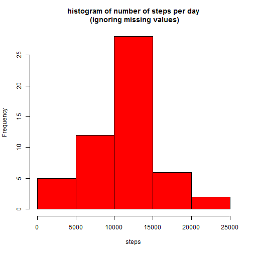
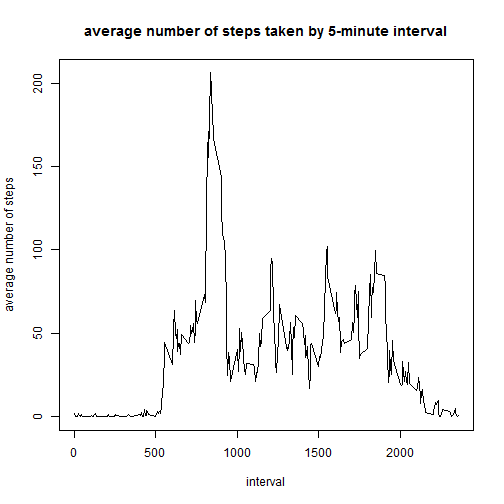
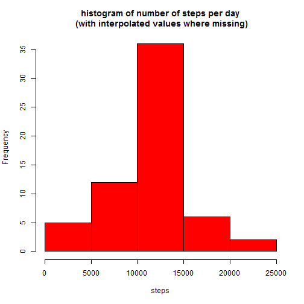
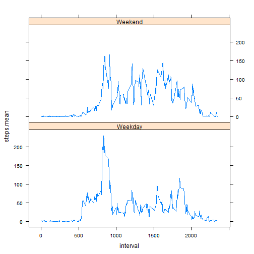

# Peer Assessment 1

This assignment makes use of data from a personal activity monitoring device. This device collects data at 5 minute intervals through the day. The data consists of two months of data from an anonymous individual collected during the months of October and November, 2012 and includes the number of steps taken in 5 minute intervals each day.

## Step 1 - Import the data
Unzip the zipped datafile and then use read.csv() to import the data into a dataframe.


```r
zipfile<-"activity.zip"
file1<-"activity.csv"
unzip(zipfile, file1 ); 
## Read the file into a data frame
activity<-read.csv(file1)
```

## Step 2 - What is the mean total number of steps taken per day
In this step we calculate the total number of steps taken per day. A histogram is then produced of the total number of steps taken each day. Finally we calculate and report the mean and median of the total number of steps taken each day. For this and the next step we ignore the missing values in the dataset.


```r
## Create summary of total steps per day
if (!require(doBy)) {
    install.packages("doBy")
  library(doBy)
    require(doBy) }
```

```
## Loading required package: doBy
## Loading required package: survival
```

```r
 activitybyday<-summaryBy(steps ~ date, data = activity, FUN = sum)
 ## Noting that we cant use na.rm=TRUE in summaryBy as it will treat missing values 
 ## as zero

## Create histogram of total steps per day
 hist(activitybyday$steps, col="red", 
      main="histogram of number of steps per day\n (ignoring missing values)",
     xlab="steps")
```

 

```r
## Compute mean and median of steps per day
 mean<-mean(activitybyday$steps, na.rm=TRUE)
 median<-median(activitybyday$steps, na.rm=TRUE)
 cbind(mean, median)
```

```
##          mean median
## [1,] 10766.19  10765
```

## Step 3 - What is the average daily activity pattern?
In this step we begin by making a time series plot of the 5-minute interval (x-axis) and the average number of steps taken, averaged across all the days (y-axis).  Next we compute which 5-minute interval, on average across all the days in the dataset, contains the maximum number of steps.  As for Step 2 we ignore missing values in the dataset.


```r
## Create summary of mean steps by 5-minute interval
## Note that the default function (FUN) in summaryBy is mean
## Although we are ignoring missing values we now have to use na.rm=TRUE
## in summaryBy because, when taking means, any missing value will cause
## the mean to have a missing value
activitybyinterval<-summaryBy(steps ~ interval, data = activity, na.rm=TRUE)
plot(activitybyinterval$interval, activitybyinterval$steps, type="l",
     main="average number of steps taken by 5-minute interval",
     xlab="interval", ylab="average number of steps")
```

 

```r
## Find the interval with the maximum number of steps
maxint<-max(activitybyinterval$steps.mean)
activitybyinterval[activitybyinterval$steps==maxint,]
```

```
##     interval steps.mean
## 104      835   206.1698
```

## Step 4 - Imputing missing values
In this step we examine the missing values in the activity dataframe. First we check the number of missing values for all the fields. This shows that only the steps field has missing values. We then interpolate for these missing values using the corresponding mean value of steps for that interval using the dataframe created in Step3.  

We then repeat the histogram and calculations of mean and median for this interpolated dataframe.


```r
## Missing values
## Note that we must check all the fields
missingsteps<-sum(is.na(activity$steps))
missingdate<-sum(is.na(activity$date))
missinginterval<-sum(is.na(activity$interval))
t1<-as.data.frame(missingsteps)
t2<-as.data.frame(missingdate)
t3<-as.data.frame(missinginterval )
cbind(t1,t2,t3)
```

```
##   missingsteps missingdate missinginterval
## 1         2304           0               0
```

```r
## Impute missing values for steps
## We will do this using the mean value for the interval as
## calculated in Step 3
nrecords<-nrow(activity)
activityfill<-activity
for (i in 1:nrecords) {
  ## determine the value of the steps interpolant
  interval1<-activity$interval[i]
  stepsfill<-activitybyinterval$steps.mean[activitybyinterval$interval==interval1]
  if (is.na(activity$steps[i])) {activityfill$steps[i]<-stepsfill}
}

## Create summary of total steps per day for filled-in dataframe
activityfillbyday<-summaryBy(steps ~ date, data = activityfill, FUN = sum)
## Create histogram of total steps per day
hist(activityfillbyday$steps, col="red", 
     main="histogram of number of steps per day\n (with interpolated values where missing)",
     xlab="steps")
```

 

```r
## Compute mean and median of steps per day in the filled-in dataframe
mean<-mean(activityfillbyday$steps, na.rm=TRUE)
median<-median(activityfillbyday$steps, na.rm=TRUE)
cbind(mean, median)
```

```
##          mean   median
## [1,] 10766.19 10766.19
```
This shows that the mean remains unchanged but the median increases a little as a result of interpolating missing values using the interval means.  It is interesting that the mean is now equal to the median.

## Step 5 - Are there differences in activity patterns between weekdays and weekends?
In this step we use the date variable to split the analysis between weekdays and weekends.  A panel plot is presented of the time series of mean steps (taken across all the days for each interval) against interval. This shows clearly that weekend step rates are spread more evenly thoughout the day, wherease weekday step rates have a higher peak in the early part of the day.


```r
## Activity patterns - weekdays compared with weekends
activityfill$date1<-weekdays(as.Date(activityfill$date))
nrecords<-nrow(activityfill)
for (i in 1:nrecords) {
  ## create weekend/weekday indicator variable
  if (activityfill$date1[i] %in% c("Saturday","Sunday")) {
    activityfill$daytype[i]<-"Weekend"}
  else {activityfill$daytype[i]<-"Weekday"}
}
activityfill$daytype<-as.factor(activityfill$daytype)

## Create panel plot using Lattice plotting system
## First aggregate by interval and daytype
activityfillbyinterval<-summaryBy(steps ~ interval+daytype, data = activityfill, na.rm=TRUE)

library(lattice)
xyplot(steps.mean~interval| daytype, data= activityfillbyinterval, type="l", layout=c(1,2))
```

 
